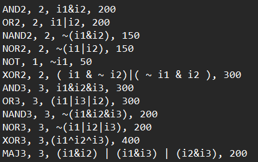
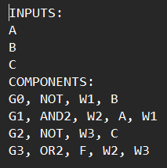
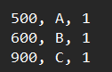
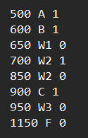
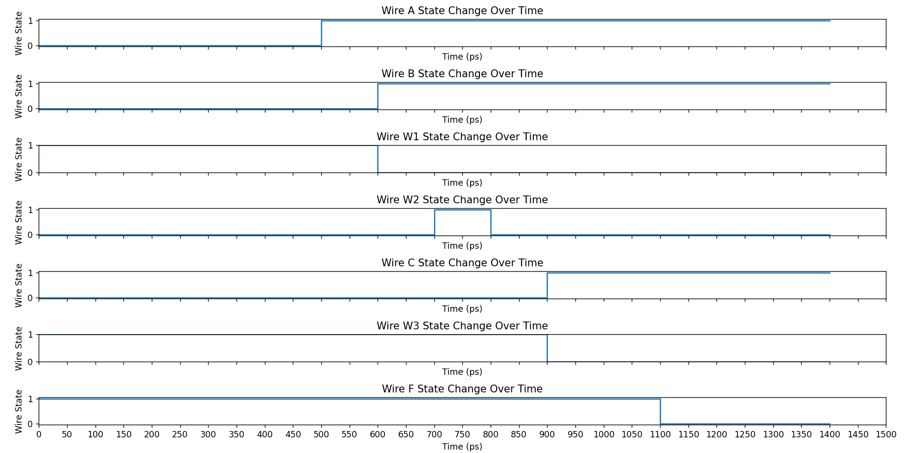

# Event-Driven Logic Circuit Simulator
## Overview

This project aims to develop an event-driven logic circuit simulator, providing users with the capability to create virtual representations of digital circuits and observe their behavior under different conditions without the need for physical construction. The simulator utilizes an event-driven approach to model the behavior of digital circuits based on changes in logical states, allowing for accurate representation of dynamic system behavior.

## Requirements

- **C++ Compiler**: Tested with G++.
- **Standard C++ Libraries**: Required libraries include `iostream`, `fstream`, `string`, `vector`, etc.

## Guidelines

Run the executable with the following command-line arguments using the terminal:

```bash
./SourceFiles/simulationMain <library_file> <circuit_file> <stimuli_file> <output_path> <common_output_path>
```

- `<library_file>`: Path to the library file.
- `<circuit_file>`: Path to the circuit description file.
- `<stimuli_file>`: Path to the stimuli file.
- `<output_path>`: Path to the output file for simulation results.
- `<common_output_path>`: Path to the common output file for intermediate results.
- Execute `plot.py` to visualize the simulation results.

## Functionality

### Parsing
The code parses input files to extract information about logical gates, circuit structure, and input stimuli.

### Simulation
It simulates the behavior of the circuit over time, considering gate delays and input stimuli.

### Output
Simulation results are written to output files, including intermediate and final results. The output results are expressed through a `.sim` file and it automatically visualizates using Python.

## Features

- **Support for Various Logical Gates**: Includes support for common logical gates such as AND, OR, NOT, etc., allowing users to construct diverse digital circuits.

- **Simulation of Complex Circuit Structures**: Offers the capability to simulate complex circuit structures, enabling users to model intricate digital systems accurately.

- **Visualization of Simulation Results**: Utilizes Python for visualizing simulation results, providing users with graphical representations to analyze and interpret circuit behavior.

- **Error Handling**: Implements robust error handling mechanisms to detect and report issues related to invalid circuit descriptions, stimuli, or circuit gates, ensuring smooth operation and accurate results.

## Example Screenshots

### Example of .Lib File

*Description: This screenshot shows an example of a library file (.Lib) containing information about logical gates.*

### Example of .Cir File

*Description: This screenshot displays an example of a circuit file (.Cir) describing the structure of the digital circuit.*

### Example of .Stim File

*Description: This screenshot illustrates an example of a stimuli file (.Stim) containing input stimuli for the circuit simulation.*

### Example of .Sim File after Circuit Evaluation

*Description: This screenshot showcases an example of a simulation output file (.Sim) generated after evaluating the circuit.*

### Example of Visualization

*Description: This screenshot demonstrates an example of visualization generated from the simulation results.*


## Usage

1. **Compilation**: Compile the code using the C++ compiler using the repo directory as the relative directory.

```bash
g++ SourceFiles/simulationMain.cpp -o SourceFiles/simulationMain
```

2. **Run the Executable**: Execute the compiled executable with the required command-line arguments.

```bash
./SourceFiles/simulationMain library_file circuit_file stimuli_file output_path common_output_path
```
When running the executable, the graph visualization will appear to showcase the delays, the output will also be stored in the .sim file. 

## Contributors
- [Ramy Shehata](https://github.com/GM-Sniper)
- [Omar Ganna](https://github.com/omar-ganna)
- [Mohamed Khaled](https://github.com/mmohamedkhaled)
